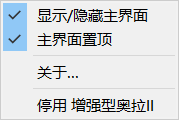

[toc]

*<正在建立通讯...>*

*<通讯已建立。>*

# 增强型奥拉 II ( AuraProII) 使用说明

：欢迎使用 增强型奥拉 II！这是为克隆人飞行员特别设计的Tech 2改进型试用版，为克隆人飞行员在遭遇战时提供最迅速的信息支援。

：您现在看到的版本是v0.1.0及之后的版本，完成于YC122年10月。如有新增功能，本使用说明也会同步更新。

：下面逐一介绍 增强型奥拉 II 的功能。

### 在zkillboard.com上搜索特定飞行员

：您可以使用 增强型奥拉 II 搜索特定飞行员名在[zkillboard.com](http://zkillboard.com/) (以下简称zkb)的信息：

：输入后点击按钮即可开始搜索：

：若搜索命中即会给出该飞行员的信息：

：在 增强型奥拉 II 中，鼠标如果移动至可以点击的文字上将变为手形。点击上图中的蓝色链接将通过浏览器打开zkb的对应页面，点击下方的白色km，可查看该飞行员的km所用的舰船及主要的武器类型（方便你针对性地考虑接战距离，或是猜测TA可能的配置）：

滚动鼠标滚轮来查看未显示完整的信息

：当然，战机转瞬即逝，你需要搜索快捷键（默认是<kbd>Ctrl</kbd> + <kbd>Alt</kbd> + <kbd>F</kbd>，可以在设置中修改）！

：如果因为网络原因搜索结果迟迟不来，你也可以直接搜索新的角色名，奥拉会帮你丢弃旧的搜索结果。

### 多个搜索结果

：如果有多个搜索结果满足条件，奥拉会列出他们（默认最多20个，可以通过设置修改），并允许你单击其中任意一个来指定搜索对象：

：如果搜索结果实在太多，奥拉会转为严格模式，只搜索名字完全相同的角色（当然，CCP允许大小写不同）

### 历史记录

：奥拉会自动记录你曾经搜索过的名字。如果你重复搜索它们，搜索时间将会有所减少。你可以在安装目录下的`history.json`里看到你搜索过的所有名字。

### 置顶与最小化

：分秒必争！奥拉的显示窗口默认置顶。你可以右键窗口空白区域或通过系统托盘来调出菜单，调整显示/隐藏以及切换窗口置顶状态。

### 设置

：奥拉支持高度化的订制。打开安装目录下的`settings.json`（记事本就可以），你可以看到许多数据项。每项的功能在每项上方的注释中有说明，请按照括号内的要求进行修改。

红框内即是可修改的项目，如果填错类型，如在“（整数）”项中错误地填入了“字符串”，可能会导致增强型奥拉 II 报错退出。

字符串项的内容需要用""英文双引号括起来。

### 修改背景图片

：修改`settings.json`里的`"backgroundPath"`项：

将这一项修改为你自定义的背景图片路径即可。

请注意，如果背景图片过亮或对比度过高很容易看不清字，建议选择较暗的图片。

图片将被拉伸成4:3，因此如果图片比例区别过大请先用画笔等软件裁剪。

### ......和，更多！

：基础的功能就是这样了，奥拉等待你发现她的更多新功能！

：Fly Safe，飞行员！

*<通讯结束。>*

